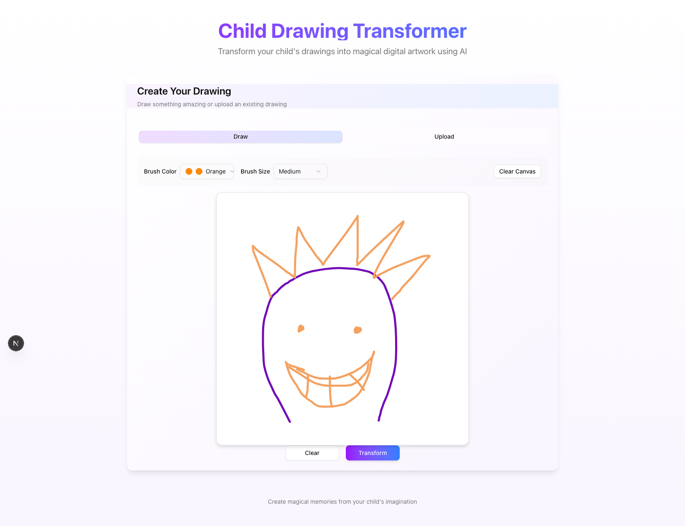

# Child Drawing Transformer

Transform children's drawings into magical digital artwork using AI-powered image generation.


## 🌟 Overview

Child Drawing Transformer is a web application that turns simple children's drawings into polished, imaginative digital artwork. The application uses AI to:

1. Analyze the drawing to understand what was drawn
2. Generate a detailed textual description
3. Transform the drawing into a magical, professional-quality digital artwork

## 🧩 Features

- **Interactive Drawing Canvas**: Create drawings directly in the browser
- **Image Upload**: Upload existing drawings
- **AI-Powered Analysis**: Accurately describes the content of children's drawings
- **Magical Transformation**: Converts simple drawings into professional-quality digital art
- **Modern UI**: Responsive, beautiful interface with light/dark mode support

## 🏗️ Project Structure

The project consists of both frontend and backend components:

### Frontend (Next.js)

```
frontend/
├── components/       # UI components
│   ├── canvas/       # Drawing & upload components
│   ├── ui/           # Shadcn UI components
│   └── drawing-transformer.tsx  # Main application component
├── src/
│   ├── app/          # Next.js app router
│   └── lib/          # Utility functions and API clients
├── public/           # Static assets
└── package.json      # Dependencies
```

### Backend (FastAPI)

```
backend/
├── extracted-text/   # Stored descriptions of analyzed images
├── images/           # Input and generated images
├── local.py          # Local development version
└── main.py           # Main FastAPI application
```

## 🖌️ How It Works



1. **Create or Upload a Drawing**:
   - Use the interactive canvas to draw directly in the browser
   - Or upload an existing drawing

2. **AI Analysis**:
   - The drawing is sent to the backend API
   - GPT-4 Vision analyzes the drawing and creates a detailed description
   - The description is stored and returned to the frontend

3. **Magical Transformation**:
   - The description is used to generate a prompt for DALL-E
   - DALL-E creates a professional-quality, magical interpretation of the drawing
   - The resulting image is displayed alongside the original

## 🚀 Getting Started

### Prerequisites

- Node.js 19+ and npm/yarn
- Python 3.9+
- Azure OpenAI API access (for GPT-4 Vision and DALL-E)

### Backend Setup

1. Clone the repository
2. Create a Python virtual environment:
   ```
   python -m venv venv
   source venv/bin/activate  # On Windows: venv\Scripts\activate
   ```
3. Install dependencies:
   ```
   pip install fastapi uvicorn python-dotenv pillow openai
   ```
4. Create a `.env` file with your Azure OpenAI credentials:
   ```
   AZURE_OPENAI_API_VERSION=2023-12-01-preview
   AZURE_OPENAI_API_KEY=your_api_key
   AZURE_OPENAI_ENDPOINT=your_endpoint
   AZURE_OPENAI_VISION_MODEL_NAME=gpt-4-vision
   AZURE_OPENAI_MODEL_NAME=dall-e-3
   ```
5. Start the backend server:
   ```
   uvicorn main:app --reload
   ```

### Frontend Setup

1. Navigate to the frontend directory
2. Install dependencies:
   ```
   npm install
   ```
3. Start the development server:
   ```
   npm run dev
   ```
4. Open your browser and navigate to `http://localhost:3000`

## 🧠 Technical Details

### Backend API Endpoints

- `POST /analyze-drawing`: Analyze a drawing and return a description
- `POST /analyze-from-base64`: Analyze a base64-encoded drawing
- `POST /generate-artwork`: Generate artwork from a description

### Used Technologies

- **Frontend**:
  - Next.js 15.3 with App Router
  - React 19.0
  - Tailwind CSS 4.0
  - Shadcn UI components
  - React Konva for canvas drawing
  - Framer Motion for animations

- **Backend**:
  - FastAPI for the API server
  - Azure OpenAI for AI services:
    - GPT-4 Vision for image analysis
    - DALL-E 3 for image generation
  - Pillow for image processing

## 🔧 Development

### Environment Variables

The backend requires the following environment variables:

```
AZURE_OPENAI_API_VERSION=2023-12-01-preview
AZURE_OPENAI_API_KEY=your_api_key
AZURE_OPENAI_ENDPOINT=your_endpoint
AZURE_OPENAI_VISION_MODEL_NAME=gpt-4-vision
AZURE_OPENAI_MODEL_NAME=dall-e-3
```

### Local Testing

You can use `backend/local.py` for local testing without running the full API server:

```
python local.py
```

This will process a single image (`input_image.jpg`) and generate the transformed version.

## 📝 License

[Include your license information here]

## 🙏 Acknowledgements

- Built with [Next.js](https://nextjs.org/)
- UI components from [shadcn/ui](https://ui.shadcn.com/)
- AI services by [Azure OpenAI](https://azure.microsoft.com/en-us/products/ai-services/openai-service)
